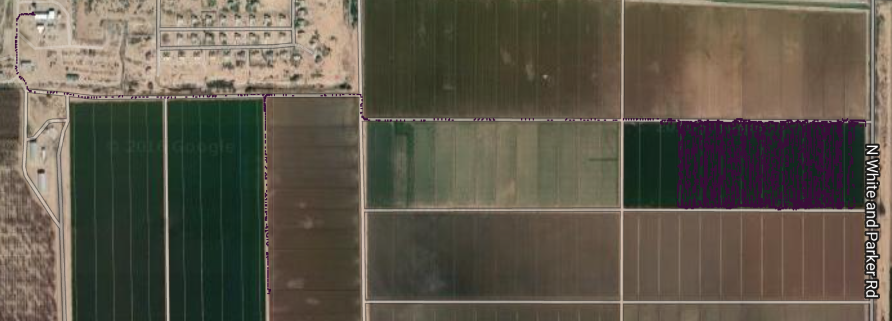

# Agrarian Labs take-home test

#### Importing the required Packages


```python
import pandas as pd
from __future__ import division
from haversine import haversine
import gmplot
import matplotlib.pyplot as plt
%matplotlib inline
```

#### Import the Dataset 


```python
data = pd.read_csv('take-home-test.csv',index_col='id')
```


```python
# Displaying the top 5 rows to get a look at the data
data.head()
```


<div>
<table border="1" class="dataframe">
  <thead>
    <tr style="text-align: right;">
      <th></th>
      <th>latitude</th>
      <th>longitude</th>
      <th>heading</th>
      <th>device_id</th>
      <th>time_in_seconds</th>
    </tr>
    <tr>
      <th>id</th>
      <th></th>
      <th></th>
      <th></th>
      <th></th>
      <th></th>
    </tr>
  </thead>
  <tbody>
    <tr>
      <th>12610468</th>
      <td>32.998882</td>
      <td>-112.024586</td>
      <td>162.857681</td>
      <td>84285656-3700-4692-b5b8-42fe94bf89db</td>
      <td>1471910400</td>
    </tr>
    <tr>
      <th>12610471</th>
      <td>33.029711</td>
      <td>-112.078511</td>
      <td>52.608635</td>
      <td>29b800c4-0ed8-45ee-bf0e-00cf838436f9</td>
      <td>1471910400</td>
    </tr>
    <tr>
      <th>12610475</th>
      <td>33.029711</td>
      <td>-112.078511</td>
      <td>101.625412</td>
      <td>29b800c4-0ed8-45ee-bf0e-00cf838436f9</td>
      <td>1471910401</td>
    </tr>
    <tr>
      <th>12610480</th>
      <td>33.029711</td>
      <td>-112.078511</td>
      <td>150.355499</td>
      <td>29b800c4-0ed8-45ee-bf0e-00cf838436f9</td>
      <td>1471910402</td>
    </tr>
    <tr>
      <th>12610486</th>
      <td>33.029716</td>
      <td>-112.078507</td>
      <td>150.157745</td>
      <td>29b800c4-0ed8-45ee-bf0e-00cf838436f9</td>
      <td>1471910403</td>
    </tr>
  </tbody>
</table>
</div>


#### Doing preliminary analysis on the dataset


```python
# check the size of the dataset
data.shape
```


    (119301, 5)


```python
# Checking for the missing values 
data.info(null_counts=True,verbose=True)
```

    <class 'pandas.core.frame.DataFrame'>
    Int64Index: 119301 entries, 12610468 to 13002840
    Data columns (total 5 columns):
    latitude           119301 non-null float64
    longitude          119301 non-null float64
    heading            119301 non-null float64
    device_id          119301 non-null object
    time_in_seconds    119301 non-null int64
    dtypes: float64(3), int64(1), object(1)
    memory usage: 5.5+ MB


###### This shows that there are no missing values in the dataset. We can proceed with the analysis without worrying about the missing values


```python
# Counting data points(rows) for each device
data.device_id.value_counts()
```


    29b800c4-0ed8-45ee-bf0e-00cf838436f9    21740
    70f3fb10-11e1-422a-9a02-e243e1225611    18319
    ae17e275-3556-422a-9727-997914cfbe06    15451
    1ef31301-9582-4d04-85e2-109e91bc0396    14989
    efa43313-4a64-4b46-b006-f7882c050d2e    13695
    84285656-3700-4692-b5b8-42fe94bf89db    12882
    02fbc9c1-2883-458d-997f-548fa37af2c6    12236
    0287939c-f943-4fe5-8a9b-bc55b39fd36a     8236
    73576478-ecf4-4a6c-a726-01d825d58da4     1701
    b407ba6a-9827-470c-8c43-e984b9ee3d5f       52
    Name: device_id, dtype: int64


```python
# Looking at each device statistics individually
grouped = data.groupby('device_id')
# Looking for time stamps for each device_id
for id in grouped.groups:
    print 'Device_id: ', id
    print grouped.get_group(id).time_in_seconds.value_counts()[:3]
    print 
```

    Device_id:  ae17e275-3556-422a-9727-997914cfbe06
    1471963958    7
    1471964393    7
    1471964461    7
    Name: time_in_seconds, dtype: int64
    
    Device_id:  02fbc9c1-2883-458d-997f-548fa37af2c6
    1471969537    13
    1471969580    11
    1471969521    11
    Name: time_in_seconds, dtype: int64
    
    Device_id:  0287939c-f943-4fe5-8a9b-bc55b39fd36a
    1471978183    11
    1471963790    10
    1471978145     9
    Name: time_in_seconds, dtype: int64
    
    Device_id:  70f3fb10-11e1-422a-9a02-e243e1225611
    1471994614    20
    1471982865     9
    1471982496     9
    Name: time_in_seconds, dtype: int64
    
    Device_id:  1ef31301-9582-4d04-85e2-109e91bc0396
    1471994464    13
    1471994474    10
    1471994392     7
    Name: time_in_seconds, dtype: int64
    
    Device_id:  73576478-ecf4-4a6c-a726-01d825d58da4
    1471963745    7
    1471965874    6
    1471963660    6
    Name: time_in_seconds, dtype: int64
    
    Device_id:  84285656-3700-4692-b5b8-42fe94bf89db
    1471995616    9
    1471995399    8
    1471995538    7
    Name: time_in_seconds, dtype: int64
    
    Device_id:  29b800c4-0ed8-45ee-bf0e-00cf838436f9
    1471922118    9
    1471995746    8
    1471995765    7
    Name: time_in_seconds, dtype: int64
    
    Device_id:  b407ba6a-9827-470c-8c43-e984b9ee3d5f
    1471962523    3
    1471962751    1
    1471962661    1
    Name: time_in_seconds, dtype: int64
    
    Device_id:  efa43313-4a64-4b46-b006-f7882c050d2e
    1471964224    14
    1471965224    12
    1471965226    11
    Name: time_in_seconds, dtype: int64
    


###### This shows that for each device there are multiple entries with the same time stamp i.e device is sending the location data multiple times at the same time, we have to correct this as there can be only 1 entry at the same time.


```python
# I will replace the rows with duplicate time stamps by the average values of the entries
newdata = data.groupby(['device_id','time_in_seconds'],as_index=False).mean()
newdata.sort(['device_id','time_in_seconds'],inplace=True)
```

    /Users/ishanchandel/anaconda2/lib/python2.7/site-packages/ipykernel/__main__.py:3: FutureWarning: sort(columns=....) is deprecated, use sort_values(by=.....)
      app.launch_new_instance()


```python
# Size of the new dataset
print "Size of New dataset: ",newdata.shape
print "No. of rows removed from the original dataset: ", len(data) - len(newdata)
```

    Size of New dataset:  (110903, 5)
    No. of rows removed from the original dataset:  8398


```python
newdata.head()
```


<div>
<table border="1" class="dataframe">
  <thead>
    <tr style="text-align: right;">
      <th></th>
      <th>device_id</th>
      <th>time_in_seconds</th>
      <th>latitude</th>
      <th>longitude</th>
      <th>heading</th>
    </tr>
  </thead>
  <tbody>
    <tr>
      <th>0</th>
      <td>0287939c-f943-4fe5-8a9b-bc55b39fd36a</td>
      <td>1471963690</td>
      <td>33.012649</td>
      <td>-112.106534</td>
      <td>343.006348</td>
    </tr>
    <tr>
      <th>1</th>
      <td>0287939c-f943-4fe5-8a9b-bc55b39fd36a</td>
      <td>1471963691</td>
      <td>33.012651</td>
      <td>-112.106626</td>
      <td>345.585480</td>
    </tr>
    <tr>
      <th>2</th>
      <td>0287939c-f943-4fe5-8a9b-bc55b39fd36a</td>
      <td>1471963692</td>
      <td>33.012651</td>
      <td>-112.106716</td>
      <td>344.029236</td>
    </tr>
    <tr>
      <th>3</th>
      <td>0287939c-f943-4fe5-8a9b-bc55b39fd36a</td>
      <td>1471963693</td>
      <td>33.012645</td>
      <td>-112.106814</td>
      <td>179.521060</td>
    </tr>
    <tr>
      <th>4</th>
      <td>0287939c-f943-4fe5-8a9b-bc55b39fd36a</td>
      <td>1471963697</td>
      <td>33.012645</td>
      <td>-112.106814</td>
      <td>352.071777</td>
    </tr>
  </tbody>
</table>
</div>


#### We need to carry out some exploratory analysis to understand the data and get an overall perspective


```python
# Creating maps for each device to show the path taken by the device
for device in newdata.device_id.unique():
    ndata = newdata[newdata.device_id == device]
    gmap = gmplot.GoogleMapPlotter(ndata.latitude.mean(), ndata.longitude.mean(),18)
    gmap.scatter(ndata.latitude, ndata.longitude, '#3B0B39', size=1, marker=False)
    #gmap.scatter(marker_lats, marker_lngs, 'k', marker=True)
    gmap.draw(device+".html")
```

#### I will show here the device paths for only 3 devices, the images show that how some of the devices travel over larger distances than other devices and show the patterns in which they do farming


```python
%%HTML
<h5>Device_id : 1ef31301-9582-4d04-85e2-109e91bc0396</h5>

<h5>Device_id : 0287939c-f943-4fe5-8a9b-bc55b39fd36a</h5>

<h5>Device_id : 84285656-3700-4692-b5b8-42fe94bf89db</h5>

```


<h5>Device_id : 1ef31301-9582-4d04-85e2-109e91bc0396</h5>

<h5>Device_id : 0287939c-f943-4fe5-8a9b-bc55b39fd36a</h5>

<h5>Device_id : 84285656-3700-4692-b5b8-42fe94bf89db</h5>


#### Now I will answer the 2 problem statements 
1. The number of turns each device takes. 
2. Total stopping time for each device


```python
# define the place holders for the new columns
newdata['ch_in_heading'] = 0
newdata['turn_taken'] = 0
newdata['speed'] = 0
newdata['time_at_rest'] = 0
newdata['distance'] = 0
# do the calculations
for i in newdata.index:
    reset_id = newdata.loc[i,'device_id']
    end = (newdata.loc[i,'latitude'],newdata.loc[i,'longitude'])
    if i == newdata.index[0] or reset_id != newdata.loc[i-1,'device_id']:
        end_heading = newdata.loc[i,'heading']
        start = end
        dist = 1000*haversine(end,start)
        speed = dist/newdata.loc[i,'time_in_seconds']
        start_time = newdata.loc[i,'time_in_seconds']
    else:
        dist =  1000*haversine(end,start)
        speed = dist/(newdata.loc[i,'time_in_seconds']-start_time)
    diff = newdata.loc[i,'heading'] - end_heading
    start = (newdata.loc[i,'latitude'],newdata.loc[i,'longitude'])
    if speed == 0:
        newdata.loc[i,'time_at_rest'] = newdata.loc[i,'time_in_seconds']-start_time
    if diff < 0:
        diff = -diff
    if diff > 180:
        diff = 360 - diff
    newdata.loc[i,'ch_in_heading'] = diff
    if diff >= 45 and newdata.loc[i+1,'heading'] == newdata.loc[i,'heading']:
        end_heading = newdata.loc[i,'heading']
        newdata.loc[i,'turn_taken'] = 1
    start_time = newdata.loc[i,'time_in_seconds']
    newdata.loc[i,'speed'] = speed
    newdata.loc[i,'distance'] = dist
```

#### I have made following assumtions to get to the results.
1. I have used heading to calculate the number of turns. If the change in heading is more than 45 
degress then it is assumed to have taken a turn.
2. I have used the haversine formula to calculate the distance between two points using latitude and longitude and then 
dividing by time taken I have calculated the speed of the device at that time. If the Speed of the device is 0 in the
time interval only then it is assumed to be stationary.


```python
# new dataset after the calculations
newdata.head()
```


<div>
<table border="1" class="dataframe">
  <thead>
    <tr style="text-align: right;">
      <th></th>
      <th>device_id</th>
      <th>time_in_seconds</th>
      <th>latitude</th>
      <th>longitude</th>
      <th>heading</th>
      <th>ch_in_heading</th>
      <th>turn_taken</th>
      <th>speed</th>
      <th>time_at_rest</th>
      <th>distance</th>
    </tr>
  </thead>
  <tbody>
    <tr>
      <th>0</th>
      <td>0287939c-f943-4fe5-8a9b-bc55b39fd36a</td>
      <td>1471963690</td>
      <td>33.012649</td>
      <td>-112.106534</td>
      <td>343.006348</td>
      <td>0.000000</td>
      <td>0</td>
      <td>0.000000</td>
      <td>0</td>
      <td>0.000000</td>
    </tr>
    <tr>
      <th>1</th>
      <td>0287939c-f943-4fe5-8a9b-bc55b39fd36a</td>
      <td>1471963691</td>
      <td>33.012651</td>
      <td>-112.106626</td>
      <td>345.585480</td>
      <td>2.579132</td>
      <td>0</td>
      <td>8.582158</td>
      <td>0</td>
      <td>8.582158</td>
    </tr>
    <tr>
      <th>2</th>
      <td>0287939c-f943-4fe5-8a9b-bc55b39fd36a</td>
      <td>1471963692</td>
      <td>33.012651</td>
      <td>-112.106716</td>
      <td>344.029236</td>
      <td>1.022888</td>
      <td>0</td>
      <td>8.419957</td>
      <td>0</td>
      <td>8.419957</td>
    </tr>
    <tr>
      <th>3</th>
      <td>0287939c-f943-4fe5-8a9b-bc55b39fd36a</td>
      <td>1471963693</td>
      <td>33.012645</td>
      <td>-112.106814</td>
      <td>179.521060</td>
      <td>163.485288</td>
      <td>0</td>
      <td>9.106296</td>
      <td>0</td>
      <td>9.106296</td>
    </tr>
    <tr>
      <th>4</th>
      <td>0287939c-f943-4fe5-8a9b-bc55b39fd36a</td>
      <td>1471963697</td>
      <td>33.012645</td>
      <td>-112.106814</td>
      <td>352.071777</td>
      <td>9.065430</td>
      <td>0</td>
      <td>0.000000</td>
      <td>4</td>
      <td>0.000000</td>
    </tr>
  </tbody>
</table>
</div>


#### Printing the 'time at rest' and 'no. of turns taken' for each device id


```python
#calculating the no. of turns and stopping time
grouped2 = newdata.groupby('device_id')
print grouped2['time_at_rest','turn_taken'].sum()
print 
print 'Note: time_at_rest is in seconds'
```

                                          time_at_rest  turn_taken
    device_id                                                     
    0287939c-f943-4fe5-8a9b-bc55b39fd36a          1866         121
    02fbc9c1-2883-458d-997f-548fa37af2c6          5474          71
    1ef31301-9582-4d04-85e2-109e91bc0396          1994         211
    29b800c4-0ed8-45ee-bf0e-00cf838436f9         27099         340
    70f3fb10-11e1-422a-9a02-e243e1225611          7835         282
    73576478-ecf4-4a6c-a726-01d825d58da4          1929          23
    84285656-3700-4692-b5b8-42fe94bf89db         20531         131
    ae17e275-3556-422a-9727-997914cfbe06          6040         183
    b407ba6a-9827-470c-8c43-e984b9ee3d5f           236           0
    efa43313-4a64-4b46-b006-f7882c050d2e          5223         205
    
    Note: time_at_rest is in seconds


#### Additional Insights from the data

###### 1. Percentage of time each device is not moving


```python
grouped2.time_at_rest.sum()/(grouped2.time_in_seconds.max()-grouped2.time_in_seconds.min())*100
```


    device_id
    0287939c-f943-4fe5-8a9b-bc55b39fd36a    12.544538
    02fbc9c1-2883-458d-997f-548fa37af2c6    21.091161
    1ef31301-9582-4d04-85e2-109e91bc0396     6.533421
    29b800c4-0ed8-45ee-bf0e-00cf838436f9    31.365672
    70f3fb10-11e1-422a-9a02-e243e1225611    23.810247
    73576478-ecf4-4a6c-a726-01d825d58da4    53.583333
    84285656-3700-4692-b5b8-42fe94bf89db    23.763557
    ae17e275-3556-422a-9727-997914cfbe06    18.980579
    b407ba6a-9827-470c-8c43-e984b9ee3d5f    98.744770
    efa43313-4a64-4b46-b006-f7882c050d2e    17.193930
    dtype: float64


###### 2. Distance travelled by each device in miles


```python
print grouped2.distance.sum()/1600
print
print "Note: All distances are in miles"
```

    device_id
    0287939c-f943-4fe5-8a9b-bc55b39fd36a    14.385722
    02fbc9c1-2883-458d-997f-548fa37af2c6    25.841148
    1ef31301-9582-4d04-85e2-109e91bc0396    33.452896
    29b800c4-0ed8-45ee-bf0e-00cf838436f9    34.839967
    70f3fb10-11e1-422a-9a02-e243e1225611    40.793252
    73576478-ecf4-4a6c-a726-01d825d58da4     4.807731
    84285656-3700-4692-b5b8-42fe94bf89db    22.243993
    ae17e275-3556-422a-9727-997914cfbe06    31.612403
    b407ba6a-9827-470c-8c43-e984b9ee3d5f     0.003147
    efa43313-4a64-4b46-b006-f7882c050d2e    25.937834
    Name: distance, dtype: float64
    
    Note: All distances are in miles


###### 3. Average speed of each device


```python
print grouped2.distance.sum()/(grouped2.time_in_seconds.max()-grouped2.time_in_seconds.min())*2.25
print "\n All Speeds are in miles/hour"
```

    device_id
    0287939c-f943-4fe5-8a9b-bc55b39fd36a    3.481587
    02fbc9c1-2883-458d-997f-548fa37af2c6    3.584347
    1ef31301-9582-4d04-85e2-109e91bc0396    3.945951
    29b800c4-0ed8-45ee-bf0e-00cf838436f9    1.451716
    70f3fb10-11e1-422a-9a02-e243e1225611    4.462885
    73576478-ecf4-4a6c-a726-01d825d58da4    4.807731
    84285656-3700-4692-b5b8-42fe94bf89db    0.926865
    ae17e275-3556-422a-9727-997914cfbe06    3.576288
    b407ba6a-9827-470c-8c43-e984b9ee3d5f    0.047404
    efa43313-4a64-4b46-b006-f7882c050d2e    3.073911
    dtype: float64
    
     All Speeds are in miles/hour

